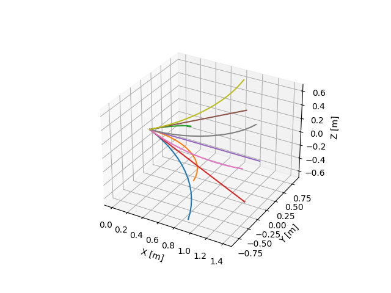
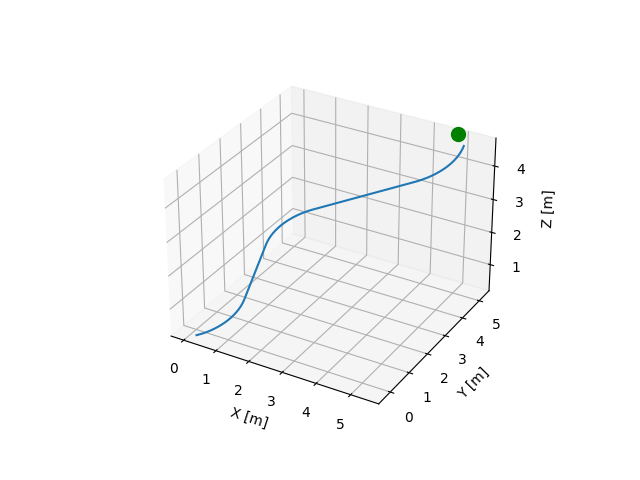

# Hybrid A*

## Description

This repository contains an implementation of Hybrid A* using Dubins Airplane Curves to plan a path in 3D space as a simplified demo of the planning algorithm used in [this paper](https://doi.org/10.2514/1.I011044). Note that Dubins Airplane Curves can have have some sharp edges in the vertical dimension since they assume instantaneous control of the flight path angle. Hybrid A* can also be used with other motion primitives that may provide smoother curves and/or better dynamic feasibility such as those used in the above mentioned paper. 

## Usage

Before executing any scripts make sure your Python environment has all requirements installed by running the following in the directory where you have cloned the repository:

```
pip install -r requirements.txt
```

Each of the Python files in the repository contains a test/example script. See the bottom of each file for these examples. 

To see the set of curves used by the planner example run:

```
python dubins.py
```



To see an example path generated with the Hybrid A* planner run:

```
python hybrid_astar.py
```


You may notice that this path usually does not end exactly at the goal. Hybrid A* terminates once it's found a path to the same cell as the goal, so the terminal error may be as much as the diagonal length of the grid size used. For a possible solution to this error, refer to the paper linked in the description (Section III.A.2 and Equations 3-5).
